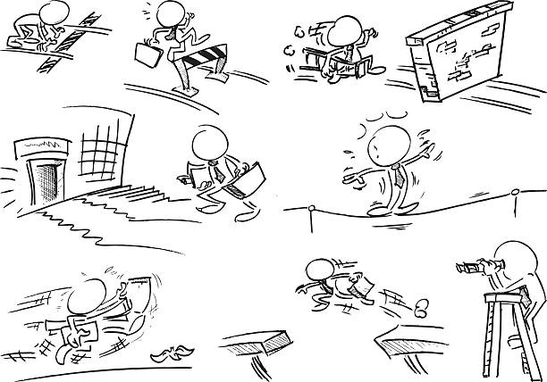

As we go deeper into the software engineer filed, we started to learn more about how to develop website.

## Semantic UI

Learning how to create a website or recreate a home page of a website is like try to climb over an obstcale course. It is a long road of
learning just like when encounter an obstcale course, there will possibly be some obstcales that you have never see before and take practices in order for you to climb over it. I feel that learning how to develop a website is the same. Except, it is was not too bad when 
we just started to learn about the HTML and CSS. It is like there is a coach next to each of the intro level of obstcales. He will teach you the skills and technique you needs to use to overcome each intro level obstacles. 

However, as we started with the Semantic UI, a framework that will make the website look better than only the basic. You need to start to figure out how to climb over the harder obsctacles on your own and by practices and experience. There will be no "Coach" to guide you. But you will overcome it after several practice. 

## My Experience

HTML and CSS are brand new to me. I've heard about them but never had a chance to learn until now. It was not too bad with the basic web design. And I am happy that I have finished my first in class WOD last week. I cannot remember the time but it's a standard time. This week is about the Semantic UI. It does not seem too hard when I watch the videos online. But when I started to do the practice WOD, I've feel the difficulty of it for someone who never recreate a website. 

And for the assignment of recreating an website of your personal choice, I have spent almost 3-4 hours to finally finished it. I've switched my choice of website so many times and decided to recreate the vans website. It was really hard in the beginning. The code from the practice WOD and Danny WOD are helpful. However, it still need endless trying to get everything in the right place. I feel that the top menu is the hardest part to recreate. Most of time, I was working on this part and try to get all the labels and menu item and the correct place. The middle image and the footer are not too bad. After complete this assignment and see what I recreated, I feel fantanstic about myself and the work I've done. This assignment is helpful when I try to do the in class WOD this week, and I was able to finish in 33 minutes.

Overall,  having a framework to make the website look better will attract more people to explore the website instead of closing it immedately after they open it. I feel that even though website design and recreation is not easy, especailly to make it looks more modern, we could still be really good at it by keep practicing. So keep up the hard work, practice makes perfect. You don't always have a "coach" there to help you. But you will find the way to get through the life obstacle course. 

